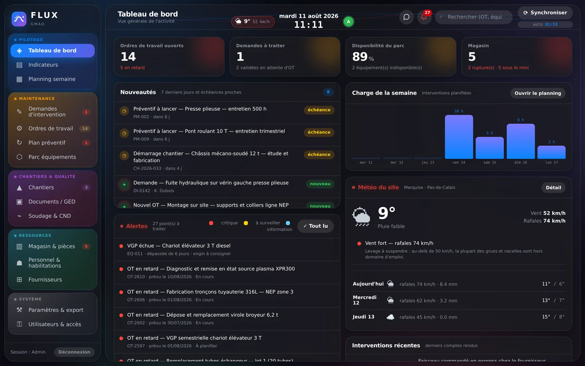

# ⚡ FLUX — GMAO Next-Gen (Maintenance, Chantiers & Qualité)

> **FLUX** est une solution de GMAO moderne, réactive et autonome, conçue pour piloter la maintenance industrielle, le suivi de chantiers et la qualité sur le terrain comme en atelier.

---

## 🎨 Aperçu & Expérience Utilisateur

* **Design Glassmorphism & macOS/iOS :** Interface fluide avec halos lumineux, animations à 60 fps, gestion native du Dark/Light mode et adaptation dynamique selon les préférences système.
* **Architecture 100% Autonome :** Fonctionne sans dépendance lourde, garantissant des temps de chargement instantanés.
* **Ergonomie Terrain :** Optimisée pour le tactile (tablettes, mobiles) et la version bureau avec support des raccourcis et du scanner QR Code.

---

## 🚀 Fonctionnalités Clés

* 📊 **Tableau de bord :** Suivi en temps réel des indicateurs critiques, des charges d'équipes et de la météo des chantiers.
* 🛠️ **Gestion des Interventions :** Visualisation par statut, gestion des urgences (`P1` à `P4`), historique complet et assignation du personnel.
* 🏗️ **Suivi de Chantiers & Arborescence :** Navigation hiérarchique par site/équipement et planning interactif.
* 📱 **Scanner QR Code & Inspection :** Scan rapide des équipements sur le terrain pour ouvrir directement les fiches de maintenance.
* 💬 **Flux de Communication Interne :** Tchat intégré par dossier et système de notifications en temps réel pour le personnel connecté.
* ⚡ **Mode Éco & Performance :** Détection automatique des ressources réseau/batterie pour adapter le rendu graphique.

---

## 📥 Installation & Lancement

 Bientôt disponible 📆
---

